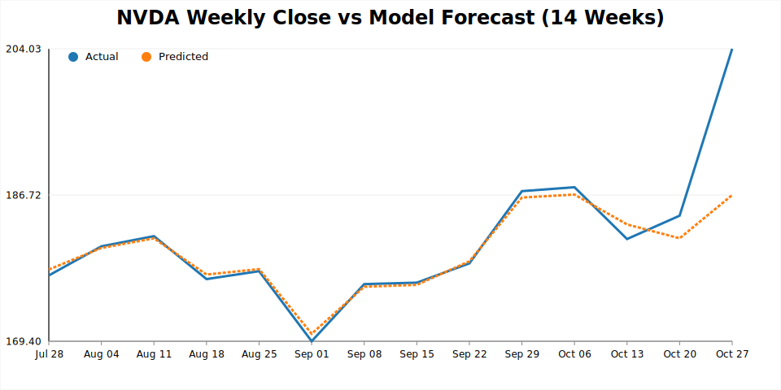
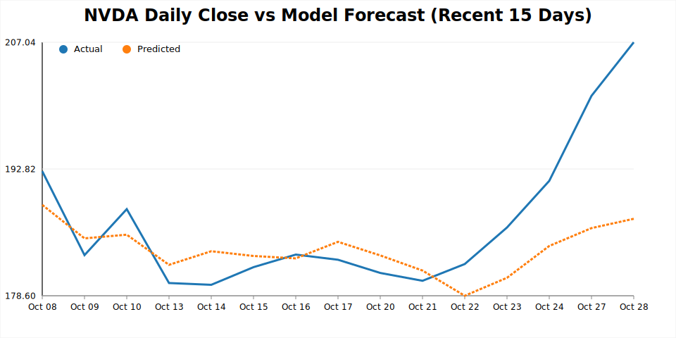

# NVIDIA Stock Price Forecasting

Predicts NVDA's next-day closing price by blending market data with news-driven sentiment.
This repository contains fresh artefacts (metrics, CSVs, interactive/PNG charts) so stakeholders can review the results immediately, alongside the full reproducible pipeline.

---

## Key Results (latest run – 28 Oct 2025)
| Window | RMSE | MAE | MAPE | R² | Directional Accuracy |
|--------|-----:|----:|------:|----:|----------------------:|
| Test (daily) | 8.18 | 5.61 | 2.87% | 0.12 | 100% |

Model selected via grid search: **Random Forest** with `n_estimators=400`, `max_depth=6`.

---

## Visual Highlights
**Weekly trend (Monday‑labelled, last 14 weeks)**


**Recent daily behaviour (last 15 trading days)**


### Data snapshots
Short excerpt from `reports/datasets/latest_predictions_weekly.csv`:

| Week (Mon) | Actual | Predicted |
|------------|-------:|----------:|
| 2025‑07‑28 | 177.20 | 177.89 |
| 2025‑08‑04 | 180.64 | 180.45 |
| 2025‑08‑11 | 181.85 | 181.59 |
| 2025‑09‑01 | 169.40 | 170.29 |
| 2025‑10‑27 | 204.03 | 186.71 |

---

## Data & Signals
- **Yahoo Finance (NVDA OHLCV + SPY benchmark)** – primary market data spanning the latest 120 trading days.
- **Alpha Vantage NEWS_SENTIMENT** – 180-day look-back of news sentiment, aggregated into rolling statistics. *(Free tier typically returns ~100 recent stories; schedule routine downloads for longer history.)*
- Optional **FRED** macro indicators (e.g., FEDFUNDS) configurable through `configs/data_sources.yaml`.

Feature engineering combines these sources into:
- Lagged returns & momentum deltas
- Rolling mean/std/min/max, Bollinger bands, volatility ranges
- RSI & MACD technical indicators
- Volume percentage change & z-scores
- Calendar encodings (weekday/month sine-cosine)
- SPY-relative spreads (price ratio, return differential)
- Sentiment rolling mean/std/change with forward/backward fill

---

## Pipeline Overview
```mermaid
flowchart LR
  subgraph Sources
    YF[Yahoo Finance\n(NVDA OHLCV, SPY)]
    AV[Alpha Vantage\nNEWS_SENTIMENT]
    FRED[(FRED Macros)]
  end

  YF --> FE[Feature Engineering]
  AV --> FE
  FRED --> FE

  FE --> MS[Model Search\n(Random Forest, Gradient Boosting)]
  MS --> BM[Best Model]
  BM -->|Refit (train+val)| EVAL[Metrics\n(validation/test)]
  BM -->|Predict| PRED[Predictions\n(daily, full, weekly)]
  PRED --> CHARTS[Charts\n(HTML, SVG)]
  EVAL --> REPORTS[reports/metrics/latest.json]
```
- Chronological split: 70% train · 15% validation · 15% test
- Grid search on both models (configurable via `configs/pipeline.yaml`)
- Weekly roll-up uses `W-MON` resampling to produce 14 labelled points

---

## Repository Map
| Path | What you’ll find |
|------|------------------|
| `configs/` | YAML for data ingestion & pipeline (120-day lookback, 14 weekly points). |
| `data/` | Example raw downloads (`raw/`), latest sentiment pull (`external/`). |
| `docs/overview.md` | One-page architecture + experimentation notes. |
| `scripts/` | `download_data.py` (Yahoo) & `download_sentiment.py` (Alpha Vantage). |
| `src/` | Modular codebase: data loaders, features, models, pipeline, evaluation. |
| `reports/metrics/latest.json` | Validation/test metrics & model selection log. |
| `reports/datasets/` | `latest_predictions_full.csv`, `latest_predictions_weekly.csv`, `latest_predictions.csv`. |
| `reports/figures/` | Interactive HTML and static SVG/PNG charts ready for slides. |
| `trained_models/latest_model.pkl` | Persisted Random Forest model. |
| `tests/` | Pytest suite covering features, metrics, and pipeline smoke test. |

Tech stack: Python 3.10, pandas, plotly, scikit-learn, statsmodels, yfinance, requests, pytest.

---

## Refresh the Pipeline
```bash
source .env                                 # loads FRED / Alpha Vantage keys
.venv/bin/python scripts/download_data.py --config configs/data_sources.yaml
.venv/bin/python scripts/download_sentiment.py --provider alpha_vantage --symbol NVDA --lookback-days 180
.venv/bin/python -m src.pipelines.train --config configs/pipeline.yaml
```
Outputs refresh in `reports/` and `trained_models/`. Run `pytest` afterwards to reconfirm integrity.

---

## Customisation Ideas
- Extend `configs/pipeline.yaml` → `models` with XGBoost, LightGBM, or temporal neural nets.
- Add richer signals (options volume, macro surprises, social sentiment) and reference them in `feature_engineering`.
- Build a Plotly Dash layer under `reports/dashboard/` for live monitoring.
- Automate end-to-end refresh with CI/CD or cron to detect drift and regenerate reports.

Feel free to fork, experiment, and showcase the forecasts!
